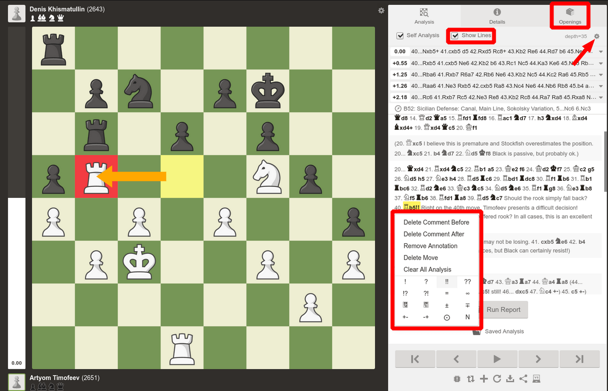

# Chess Analyzer

# How to run
- Download python 3.4
- Download python-chess library (type pip install chess into terminal)
- Download django (pip install django)

- Download stockfish:
Go to https://stockfishchess.org/download/
Download the version for your operating system
Extract the archive
edit line 43 in views.py    stockfish_path = r"C:\Users\legog\chess-analyzer\stockfish\stockfish-windows-x86-64-avx2.exe" with your path to stockfish .exe file

- type python manage.py runserver

# How to contribute
Follow this project board to know the latest status of the project: [http://...]([http://...])  

### How to build
- Download this repo
- Open terminal and cd to root directory
- Run command: python -m venv .venv
- Run command Linux/MacOS: source .venv/bin/activate
- Run command Windows: .venv\Scripts\activate
- Run command: pip install -r requirements.txt
- Install stockfish engine and add its folder path to system environment variable
- Rename the executable or binary to "stockfish" (with application file extension)
